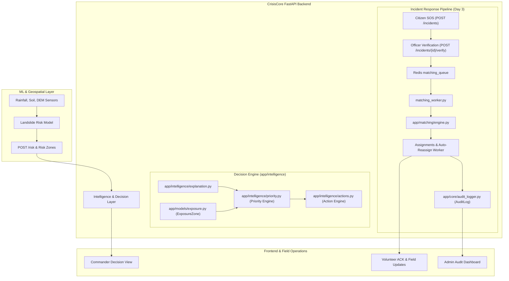
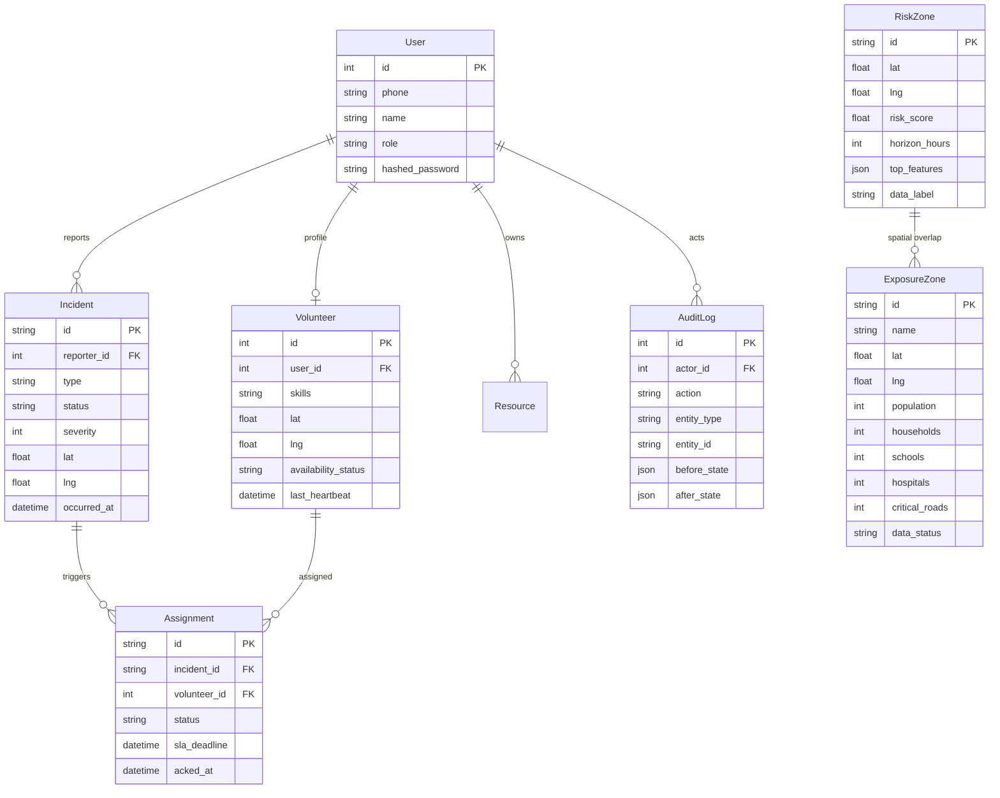

# CrisisCore Backend

CrisisCore is an AI-assisted disaster-management backend for landslide risk monitoring and operational response coordination in the North Eastern Region (NER) of India.

The backend connects hazard intelligence to field operations:

$$\text{Risk Prediction} \longrightarrow \text{Explainability} \longrightarrow \text{Exposure / Impact} \longrightarrow \text{Operational Priority} \longrightarrow \text{Recommended Action} \longrightarrow \text{Incident Response}$$

---

## Table of Contents

- [Project Purpose](#project-purpose)
- [Why CrisisCore?](#why-crisiscore)
- [Architecture](#architecture)
- [Day 4 — Intelligence & Decision Layer](#day-4--intelligence--decision-layer)
  - [Operational Priority Engine](#operational-priority-engine)
  - [Exposure Model](#exposure-model)
  - [Driver Explanation Layer](#driver-explanation-layer)
  - [Action Recommendations Engine](#action-recommendations-engine)
  - [Data Provenance](#data-provenance)
  - [What-If Scenario Simulation](#what-if-scenario-simulation)
- [ML → Backend Contract](#ml--backend-contract)
- [Incident Response Lifecycle (Day 3)](#incident-response-lifecycle-day-3)
- [Role-Based Access Control (RBAC)](#role-based-access-control-rbac)
- [API Overview](#api-overview)
- [Database Schema](#database-schema)
- [Development Setup](#development-setup)
- [Environment Variables](#environment-variables)
- [Docker & Deployment](#docker--deployment)
- [Testing](#testing)
- [SIH Demonstration Flow](#sih-demonstration-flow)
- [Implementation Status & Roadmap](#implementation-status--roadmap)

---

## Project Purpose

Landslides in the North Eastern Region (NER) cause severe disruptions to road connectivity, critical infrastructure, and isolated communities during the monsoon season. Most existing early-warning tools output raw geological or hydrological risk scores without operational context.

The CrisisCore backend bridges that gap by providing:

1. **Hazard Risk Ingestion & Serving:** Serving geospatial risk zones and ML predictions.
2. **Feature Explainability:** Translating raw model drivers into human-understandable hazard factors.
3. **Exposure & Vulnerability Context:** Overlaying population, schools, hospitals, and critical road links onto hazard zones.
4. **Explainable Priority Scoring:** Evaluating risk alongside vulnerability, exposure, and response capacity gap.
5. **Deterministic Action Guidance:** Generating actionable response recommendations for emergency managers.
6. **Citizen SOS Ingestion:** Accepting online and offline/batched emergency reports.
7. **Officer Verification Workflow:** State transitions guarded by role authorization.
8. **Volunteer & Resource Matching:** Haversine proximity, skill compatibility, and emergency resource availability.
9. **Assignment & SLA Lifecycle:** Automated timeout-driven reassignments when volunteers do not acknowledge in time.
10. **Immutable Audit Logging:** Recording every state transition, actor, and delta for administrative oversight.

---

## Why CrisisCore?

Standard disaster warning systems stop at generating a hazard score. A high hazard score in an uninhabited forest requires very different operational handling than a moderate hazard score threatening a isolated hospital or single mountain highway.

CrisisCore adds an explicit, explainable operational decision layer:

```
           Hazard Risk (ML Model)
                     +
          Human & Asset Exposure
                     +
          Community Vulnerability
                     +
         Response Capacity Gap (Supply vs Demand)
                     ↓
        Operational Priority Score (0–100)
                     ↓
        Actionable Recommendations for DDMA / SDRF
```

* **Clear Boundary:** The ML model predicts physical hazard probability; the backend computes operational priority.
* **No Phantom AI:** Priority calculation and action recommendations are deterministic, rule-based, and auditable.
* **Human-in-the-Loop:** Recommendations assist District Disaster Management Authorities (DDMA) and emergency managers rather than taking autonomous emergency commands.

---

## Architecture



---

## Day 4 — Intelligence & Decision Layer

### Operational Priority Engine
**File:** `app/intelligence/priority.py`

Combines four normalized dimensions ($0.0 \to 1.0$) into an explainable composite priority score ($0 \to 100$):

$$\text{Priority} = 100 \times \left( W_{\text{risk}} \cdot S_{\text{risk}} + W_{\text{exposure}} \cdot S_{\text{exposure}} + W_{\text{vulnerability}} \cdot S_{\text{vulnerability}} + W_{\text{gap}} \cdot S_{\text{gap}} \right)$$

* **Configured Weights (sum to 1.0):**
  * $W_{\text{risk}} = 0.35$ (`PRIORITY_W_RISK`)
  * $W_{\text{exposure}} = 0.30$ (`PRIORITY_W_EXPOSURE`)
  * $W_{\text{vulnerability}} = 0.20$ (`PRIORITY_W_VULNERABILITY`)
  * $W_{\text{gap}} = 0.15$ (`PRIORITY_W_RESPONSE_GAP`)

* **Categorical Triage Thresholds:**
  * **CRITICAL:** $\ge 80.0$
  * **HIGH:** $\ge 60.0$
  * **MEDIUM:** $\ge 40.0$
  * **LOW:** $< 40.0$

* **Normalization Factors:**
  * **Exposure:** Evaluates population (cap 5,000), households (cap 1,500), schools (cap 5), hospitals (cap 3), and critical access roads (cap 3).
  * **Vulnerability:** Evaluates distance to nearest hospital (>50 km max vulnerability), early-warning infrastructure presence, and road access quality (`good`, `moderate`, `poor`).
  * **Response Gap:** Ratio of incident demand (severity 1–5) to local response supply (available volunteers within 25 km + nearby resources within 10 km, capped at 10). If supply is 0, gap is 1.0.

### Exposure Model
**File:** `app/models/exposure.py` (`ExposureZone`)

Stores granular demographic and infrastructure metadata for critical settlement zones:
* `population`, `households`
* `schools`, `hospitals`, `critical_roads`
* `distance_to_hospital_km`, `has_early_warning`, `road_access_quality`
* `data_status` (`live`, `simulated`, `replayed`, `stale`) and `source` attribution.

### Driver Explanation Layer
**File:** `app/intelligence/explanation.py`

Translates raw ML driver keys into human-readable descriptions, units, and categories:
* `rainfall_24h` $\to$ **24-hour Rainfall** (mm, Hydrology)
* `rainfall_7day` $\to$ **7-day Cumulative Rainfall** (mm, Hydrology)
* `slope` $\to$ **Terrain Slope** (degrees, Terrain)
* `soil_moisture` $\to$ **Soil Moisture** (fraction, Soil)
* `ndvi` $\to$ **Vegetation Cover (NDVI)** (index, Land Cover)
* *Graceful Fallback:* Unmapped drivers are formatted as safe, title-cased labels without throwing errors.

### Action Recommendations Engine
**File:** `app/intelligence/actions.py`

Generates deterministic, rule-based operational guidance based on risk level, priority score, exposure attributes, and response capacity gap:
* High/Critical Priority: DDMA alerts, high-density evacuation planning, critical road restriction advisories, hospital evacuation staging, school precaution notices.
* Severe Resource Gap ($\ge 0.7$): Inter-district mutual aid requests, SDMA escalation.
* Moderate Risk: Frequency increase for sensor checks, community advisories for low-lying settlements.
* Routine: Monitoring continuation.

### Data Provenance
To prevent synthetic or simulated test data from being mistaken for active field measurements, every risk, exposure, and intelligence response explicitly includes `data_status`:
* `live` — Real-time telemetry / verified field ingestion.
* `simulated` — Generated or synthetic benchmark data for training/demo.
* `replayed` — Historical sensor event stream for scenario playback.
* `stale` — Data past expiration / freshness TTL.

### What-If Scenario Simulation
**Endpoint:** `POST /intelligence/whatif` (Restricted to `officer` and `admin`)

Allows decision-makers to evaluate hypothetical scenarios (e.g. $+250\text{ mm}$ anticipated rainfall) to observe projected risk elevation, priority changes, and newly triggered actions.
* Every response explicitly carries `"scenario_label": "SIMULATION — NOT A FORECAST"`.
* Output is explicitly tagged `"data_status": "simulated"`.

---

## ML → Backend Contract

The backend interacts with the ML pipeline via a stable Pydantic schema contract:

### Prediction Request (`POST /risk`)
```json
{
  "lat": 26.15,
  "lng": 91.75,
  "horizon_hours": 24,
  "features": {
    "rainfall_24h": 145.2,
    "slope": 38.5
  }
}
```

### Prediction Response (`RiskPredictionResponse`)
```json
{
  "risk_score": 0.82,
  "risk_level": "HIGH",
  "confidence": 0.84,
  "drivers": [
    "rainfall_24h",
    "rainfall_7day",
    "slope"
  ],
  "data_status": "live"
}
```

---

## Incident Response Lifecycle (Day 3)

```
1. Citizen SOS      ──▶  POST /incidents (status: reported)
                            │
2. Verification     ──▶  POST /incidents/{id}/verify (officer/admin only)
                            │  └─▶ Enqueues incident_id to Redis matching_queue
                            │  └─▶ Records audit log event
                            ▼
3. Matching Worker  ──▶  matching_worker.py pops queue
                            │  └─▶ Computes Haversine proximity (0.6) + Skill match (0.4) + Resource boost
                            │  └─▶ Creates Assignment (status: pending, SLA deadline: 5 min)
                            ▼
4. Notification     ──▶  dispatcher.py notifies candidate volunteer
                            ▼
5. Volunteer Action ──▶  POST /assignments/{id}/ack  ──▶ (status: acked)
                         POST /assignments/{id}/status ──▶ (status: in_progress ──▶ done)
                            │
                            ├─ (If SLA expires without ACK):
                            └─▶ auto_reassign.py marks assignment timed_out and reassigns
```

---

## Role-Based Access Control (RBAC)

Auth tokens are signed JWTs containing `sub` (User ID) and `role`:

| Role | Permissions |
|---|---|
| `citizen` | Submit SOS incidents, view incident status, query risk and decision endpoints. |
| `volunteer` | Send location heartbeats (`POST /volunteers/heartbeat`), acknowledge (`/ack`) and update own assignments (`/status`). |
| `officer` | Verify or reject incidents (`/verify`, `/reject`), manual assignments, manage exposure zones, execute what-if simulations. |
| `admin` | Full system access, audit log review, configuration updates, all officer capabilities. |

---

## API Overview

### Intelligence & Risk (Day 4)
| Method | Path | Auth / Role | Description |
|---|---|---|---|
| `POST` | `/intelligence/decision` | Authenticated | Computes combined Risk $\to$ Explanation $\to$ Exposure $\to$ Priority $\to$ Actions for a coordinate. |
| `GET` | `/intelligence/decision/{zone_id}` | Authenticated | Returns decision view for an existing risk zone. |
| `POST` | `/intelligence/whatif` | `officer`, `admin` | Simulates scenario overlays (labelled as `SIMULATION — NOT A FORECAST`). |
| `POST` | `/intelligence/exposure` | `officer`, `admin` | Registers new population / infrastructure exposure zone. |
| `GET` | `/intelligence/exposure` | Authenticated | Lists all registered exposure zones. |
| `GET` | `/intelligence/exposure/nearby` | Authenticated | Finds exposure zones within a radius query. |
| `GET` | `/risk` | Authenticated | Fetches risk zones (supports bounding box and horizon filtering). |
| `POST` | `/risk` | `officer`, `admin` | ML prediction contract endpoint. |
| `GET` | `/risk/{zone_id}/explain` | Authenticated | Returns raw feature impacts and explanation string. |

### Incident & Assignment Operations (Day 3)
| Method | Path | Auth / Role | Description |
|---|---|---|---|
| `POST` | `/incidents` | `citizen+` | Creates a new emergency SOS incident. |
| `GET` | `/incidents` | Authenticated | Lists/filters incidents by status, type, severity. |
| `GET` | `/incidents/{id}` | Authenticated | Fetches incident details. |
| `POST` | `/incidents/{id}/verify` | `officer`, `admin` | Verifies incident and triggers automated matching. |
| `POST` | `/incidents/{id}/reject` | `officer`, `admin` | Rejects invalid/duplicate incident. |
| `POST` | `/incidents/sync` | `citizen+` | Offline incident ingestion & idempotent sync batch. |
| `POST` | `/assignments` | `officer`, `admin` | Manually creates volunteer assignment. |
| `POST` | `/assignments/{id}/ack` | Assigned volunteer | Acknowledges assignment within SLA window. |
| `PATCH` | `/assignments/{id}/status` | Assigned volunteer | Transitions status (`in_progress` $\to$ `done`). |
| `POST` | `/volunteers/heartbeat` | `volunteer+` | Updates volunteer GPS position and availability. |

### Platform & Health
| Method | Path | Auth / Role | Description |
|---|---|---|---|
| `GET` | `/health` | None | Health check for DB, Redis, and queue depths. |
| `POST` | `/auth/register` | None | Registers citizen, volunteer, or officer. |
| `POST` | `/auth/login` | None | Authenticates user and returns JWT. |
| `GET` | `/notifications` | Authenticated | Notification delivery history. |
| `WS` | `/ws/status` | None | WebSocket channel for real-time incident updates. |

---

## Database Schema



---

## Development Setup

### 1. Prerequisites
* Python 3.11+
* Redis (running locally or in Docker on port 6379)

### 2. Setup Virtual Environment
```bash
# Clone repository and enter directory
git checkout AJ-backend-work

# Create and activate virtual environment
python -m venv .venv
source .venv/bin/activate   # On Windows: .venv\Scripts\Activate.ps1

# Install dependencies
pip install -r requirements.txt
```

### 3. Configure Environment
Copy the example configuration:
```bash
cp .env.example .env
```

### 4. Run Backend Server
```bash
python run.py
# Server runs at http://localhost:8000
# OpenAPI Docs at http://localhost:8000/docs
```

---

## Environment Variables

| Variable | Required | Default | Description |
|---|---|---|---|
| `DATABASE_URL` | No | `sqlite+aiosqlite:///./crisiscore.db` | Async SQLAlchemy database URL. For PostgreSQL: `postgresql+asyncpg://...` |
| `REDIS_URL` | No | `redis://localhost:6379/0` | Redis connection URL for matching queue and Pub/Sub. |
| `JWT_SECRET` | No (Dev) | `crisiscore-dev-secret-change-in-prod` | HMAC-SHA256 signing secret for JWT tokens. |
| `JWT_EXPIRE_MINUTES` | No | `1440` | JWT token expiration lifetime (minutes). |
| `AUTO_REASSIGN_MINUTES` | No | `5` | Minutes before unacknowledged volunteer assignment times out. |
| `ASSIGNMENT_ACK_TIMEOUT_SECONDS` | No | `300` | SLA timeout in seconds for volunteer ACK. |
| `NOTIFICATION_PROVIDER` | No | `console` | Dispatcher backend (`console`, `twilio`, `fcm`). |
| `PRIORITY_W_RISK` | No | `0.35` | Priority weight for hazard risk score. |
| `PRIORITY_W_EXPOSURE` | No | `0.30` | Priority weight for population and infrastructure exposure. |
| `PRIORITY_W_VULNERABILITY` | No | `0.20` | Priority weight for community vulnerability factors. |
| `PRIORITY_W_RESPONSE_GAP` | No | `0.15` | Priority weight for volunteer / resource capacity deficit. |

---

## Docker & Deployment

```bash
# Run backend + PostgreSQL + Redis via Docker Compose
docker compose up --build
```

* **Healthcheck:** `GET /health` returns DB connectivity, Redis ping, and queue depth.
* **Production Deployment:** Designed for containerized hosting (e.g. AWS ECS, Render, Railway). Set `DATABASE_URL` to managed PostgreSQL, `REDIS_URL` to managed Redis, and generate a secure `JWT_SECRET`.

---

## Testing

Run the test suite using `pytest`:

```bash
python -m pytest -q
```

### Verified Test Breakdown (61/61 Passing)
* **Day 1–3 Regression Suite (32 tests):**
  * `tests/test_api.py` — Auth, CRUD, health, RBAC endpoints.
  * `tests/test_audit_lifecycle.py` — Audit logs on assignment state changes.
  * `tests/test_auto_reassign.py` — Timeout and deduplication on auto-reassignment.
  * `tests/test_matching_queue.py` — Redis matching queue enqueue/dequeue.
  * `tests/test_offline_sync.py` — Offline batch incident sync and deduplication.
  * `tests/test_happy_path.py` — Complete SOS $\to$ Verify $\to$ Match $\to$ Assign $\to$ ACK $\to$ Resolve path.
  * `tests/test_day3_integration.py` — Assignment RBAC, rejection guards, worker handling.
  * `tests/test_notification_retry.py` & `tests/test_websocket.py` — Dispatcher resilience.
* **Day 4 Intelligence Suite (29 tests):**
  * `tests/test_day4_intelligence.py` — Priority formula weights, factor normalization, driver explanations, action recommendation rules, exposure CRUD, unified decision endpoint, what-if scenario simulations, and RBAC.

---

## SIH Demonstration Flow

A recommended 10-step evaluation flow for evaluators:

1. **View Predicted Risk:** Query `GET /risk` to inspect current risk zones and hazard scores.
2. **Inspect Driver Explanation:** Query `GET /risk/{zone_id}/explain` or `POST /intelligence/decision` to see human-readable hazard drivers (e.g. 24h rainfall, steep terrain slope).
3. **Review Exposure Profile:** Show demographic exposure (population, households, schools, hospitals) linked to the location.
4. **Compute Operational Priority:** Show how Risk (0.35) + Exposure (0.30) + Vulnerability (0.20) + Response Gap (0.15) produce an explainable Priority Score ($0 \to 100$) and Triage Level (`CRITICAL`/`HIGH`/`MEDIUM`/`LOW`).
5. **Inspect Recommended Actions:** Review deterministic advisory actions generated for DDMA officers.
6. **Scenario What-If:** Execute `POST /intelligence/whatif` with $+250\text{ mm}$ rainfall to demonstrate priority escalation (clearly tagged `SIMULATION — NOT A FORECAST`).
7. **Citizen SOS Trigger:** Submit emergency SOS via `POST /incidents`.
8. **Officer Verification & Queueing:** Officer verifies incident via `POST /incidents/{id}/verify`; task is enqueued to Redis.
9. **Matching & Volunteer ACK:** `matching_worker.py` matches the closest skilled volunteer and resource; volunteer acknowledges via `POST /assignments/{id}/ack`.
10. **Audit Trail Verification:** Inspect `AuditLog` records verifying complete traceability of state transitions.

---

## Implementation Status & Roadmap

### Status
* **Day 1 — Core Backend Foundation:** ✅ COMPLETE
* **Day 2 — Risk, Data & API Foundation:** ✅ COMPLETE
* **Day 3 — Incident Response Lifecycle & Hardening:** ✅ COMPLETE
* **Day 4 — Intelligence & Decision Layer:** ✅ COMPLETE
* **Day 5 — Reliability, Security & Observability:** ⏳ NEXT

### Completed Features
- [x] Async SQLAlchemy + SQLite / PostgreSQL database layer
- [x] JWT Authentication & 4-tier Role-Based Access Control (RBAC)
- [x] Real-time Landslide Risk prediction contract and zone retrieval
- [x] Offline-first incident batch ingestion & deduplication
- [x] Redis-backed asynchronous volunteer matching queue and worker
- [x] Multi-factor volunteer matching (Haversine proximity + skills + nearby resources)
- [x] Assignment state machine with automated SLA-driven timeout reassignment
- [x] Comprehensive immutable audit logging on all entity mutations
- [x] Operational Priority Engine (Risk $\times$ Exposure $\times$ Vulnerability $\times$ Response Gap)
- [x] Feature driver explanation layer with static human-readable metadata
- [x] Rule-based Action Recommendations Engine
- [x] Transparent data provenance tagging (`live`, `simulated`, `replayed`, `stale`)
- [x] What-If scenario simulation endpoint with simulation-safe guarantees

### Next Steps (Day 5)
- [ ] Comprehensive security hardening & rate limiting
- [ ] Advanced telemetry, Prometheus metrics, and structured logging
- [ ] Production deployment verification and multi-region failover tests
