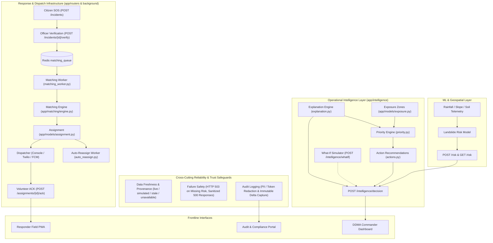
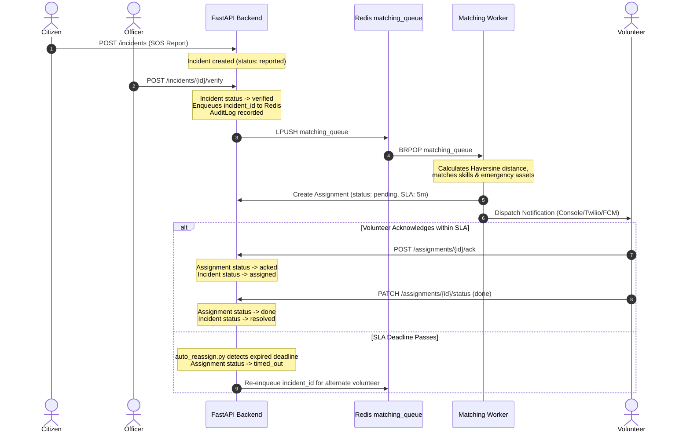

# CrisisCore Backend

CrisisCore is an AI-assisted disaster management and emergency response platform designed around early risk intelligence and operational response coordination for landslide-prone regions of the North Eastern Region (NER) of India. The platform bridges the critical operational gap between hazard prediction and field response by connecting:

$$\text{Predict} \longrightarrow \text{Explain} \longrightarrow \text{Assess Exposure} \longrightarrow \text{Calculate Priority} \longrightarrow \text{Recommend Action} \longrightarrow \text{Mobilize Response} \longrightarrow \text{Audit} \longrightarrow \text{Fail Safely}$$

> **System Scope & Integrity Note:** CrisisCore does not claim to independently predict real-world natural disasters with absolute certainty. Rather, it provides an end-to-end operational decision-support system that combines ML hazard intelligence, explainability, demographic exposure mapping, deterministic priority triage, responder mobilization, auditability, and data-reliability safeguards.

---

## Table of Contents

- [SIH Problem Statement](#sih-problem-statement)
- [Why CrisisCore is Different](#why-crisiscore-is-different)
- [Core Architecture](#core-architecture)
- [Backend Architecture](#backend-architecture)
- [Day-by-Day Implementation](#day-by-day-implementation)
- [Data Provenance & Freshness](#data-provenance--freshness)
- [Operational Priority Engine](#operational-priority-engine)
- [What-If Scenario Simulation](#what-if-scenario-simulation)
- [Emergency Response Pipeline](#emergency-response-pipeline)
- [API Reference](#api-reference)
- [Security Architecture](#security-architecture)
- [Reliability & Failure Safety](#reliability--failure-safety)
- [Observability & Audit Trail](#observability--audit-trail)
- [Configuration](#configuration)
- [Local Development](#local-development)
- [Testing](#testing)
- [Data / ML Boundary](#data--ml-boundary)
- [Current Limitations](#current-limitations)
- [Future Work](#future-work)
- [SIH Demonstration Flow](#sih-demonstration-flow)
- [Questions Judges May Ask](#questions-judges-may-ask)

---

## SIH Problem Statement

* **ID:** SIH26001 — Disaster Management
* **Ministry / Organization:** Ministry of Development of North Eastern Region (MDoNER)
* **Title:** AI-Based Early Warning and Landslide Risk Monitoring System in NER

### How CrisisCore Solves the Problem
During the monsoon season, the 8 North Eastern states experience frequent landslides that sever highway corridors, isolate hill communities, and overwhelm local response resources. Standard monitoring tools produce raw sensor readings or risk heatmaps that leave disaster management authorities (DDMA/SDMA) with difficult triage questions: *Which settlement is most vulnerable? Which road is critical? Where are responders lacking?*

CrisisCore addresses this by:
1. **Serving ML Risk Intelligence:** Ingesting geospatial hazard predictions with transparent data provenance.
2. **Explaining Drivers:** Translating model features into human-understandable physical factors.
3. **Evaluating Exposure & Vulnerability:** Overlaying settlement populations, hospitals, schools, and lifeline highways.
4. **Calculating Operational Priority:** Deterministically computing triage scores based on risk, exposure, vulnerability, and capacity gaps.
5. **Recommending Civil Defense Actions:** Generating rule-based actionable advisories for emergency managers.
6. **Coordinating Dispatch & Response:** Managing citizen SOS ingestion, officer verification, volunteer matching, SLA tracking, and immutable audit logs.

---

## Why CrisisCore is Different

The key differentiator of CrisisCore is **not** simply "using AI" — it is the **complete operational decision loop**.

```
Traditional Disaster Early Warning:
  Sensor / Satellite Data ──▶ ML Model ──▶ Hazard Map (Stops at Risk Score)

CrisisCore Operational Platform:
  ML Hazard Model
    │
    ▼
  Physical Factor Explanation (Why is it risky?)
    │
    ▼
  Demographic & Infrastructure Exposure (Who and what is in danger?)
    │
    ▼
  Community Vulnerability Context (What increases consequences?)
    │
    ▼
  Response Capacity Gap (Do we have enough local responders and supplies?)
    │
    ▼
  Deterministic Priority Engine (0–100 Triage Score)
    │
    ▼
  Actionable Recommendations (DDMA advisories, evacuation, road closures)
    │
    ▼
  Incident Response & Volunteer Dispatch (Who can actually respond?)
    │
    ▼
  Immutable Audit Trail & Fail-Safe Degradation
```

### Three Explicit Layers of Responsibility
* **The ML / Risk Layer answers:** *"How physically risky is this location?"*
* **The Operational Intelligence Layer answers:** *"Where should emergency managers act first, why, and what actions should they consider?"*
* **The Response Layer answers:** *"Who is available nearby to respond right now?"*

---

## Core Architecture



---

## Backend Architecture

The backend is built with **FastAPI**, **SQLAlchemy (Async)**, **Redis**, and **Pydantic v2**. The codebase is organized cleanly by domain responsibility:

```
app/
├── background/
│   ├── auto_reassign.py       # Background task monitoring unacknowledged assignment SLA timeouts
│   └── matching_worker.py     # Background worker consuming Redis queue for multi-factor dispatch
├── core/
│   ├── audit_logger.py        # SQLAlchemy event listeners recording mutations with PII masking
│   ├── auth.py                # JWT creation, verification, password hashing, and RBAC guards
│   ├── config.py              # Centralized environment settings with validation
│   ├── database.py            # Async engine, sessionmaker, and Base model declarations
│   └── redis.py               # Redis async client connection pool
├── intelligence/
│   ├── actions.py             # Deterministic civil defense recommendation generator
│   ├── explanation.py         # Human-readable mapping and categorization of ML driver keys
│   └── priority.py            # Deterministic composite priority formula & factor normalizers
├── matching/
│   └── engine.py              # Haversine distance, skill matching, and resource availability scoring
├── models/
│   ├── assignment.py          # Volunteer assignment model with SLA deadlines
│   ├── audit.py               # AuditLog model capturing entity diffs and actor IDs
│   ├── exposure.py            # ExposureZone demographic and infrastructure attributes
│   ├── incident.py            # Incident emergency report model
│   ├── mesh.py                # Mesh network message relay model
│   ├── notification.py        # Notification delivery logs
│   ├── resource.py            # Emergency resources (ambulances, boats, earthmovers)
│   ├── risk.py                # RiskZone geospatial predictions and feature payloads
│   ├── user.py                # User credentials and RBAC roles
│   └── volunteer.py           # Volunteer profiles, skills, and GPS coordinates
├── notifications/
│   └── dispatcher.py          # Notification delivery abstraction (Console, Twilio, FCM)
├── realtime/
│   └── ws_manager.py          # WebSocket connection manager and Redis Pub/Sub forwarder
├── routers/
│   ├── assignments.py         # Assignment lifecycle, volunteer ACK, status transitions
│   ├── auth.py                # User registration and JWT login
│   ├── health.py              # DB and Redis health checks with queue metrics
│   ├── incidents.py           # SOS submission, officer verify/reject, offline sync
│   ├── intelligence.py        # Unified decision endpoint, what-if simulator, exposure CRUD
│   ├── mesh.py                # Mesh relay ingestion endpoints
│   ├── notifications.py       # Notification history
│   ├── resources.py           # Emergency equipment management
│   ├── risk.py                # Risk predictions, zone queries, driver explanation
│   ├── status.py              # System status endpoint
│   └── volunteers.py          # Volunteer registration, heartbeat, and status
├── schemas/                   # Pydantic schemas for request/response validation
└── main.py                    # FastAPI application initialization, lifespan, CORS, error handler
```

---

## Day-by-Day Implementation

| Milestone | Key Implementations | Primary Files | Commit Hash | Verified Tests |
|---|---|---|---|---|
| **Day 1: Foundation** | Async database setup, JWT authentication, 4-tier RBAC (`citizen`, `volunteer`, `officer`, `admin`), core models, notification interface. | `app/core/`, `app/models/`, `app/routers/auth.py` | `4b3b617` | Baseline passing |
| **Day 2: Ingestion & Queues** | Offline incident batch sync (`/incidents/sync`), Redis matching queue integration, real-time WebSocket status channel (`/ws/status`). | `app/routers/incidents.py`, `app/realtime/`, `app/core/redis.py` | `9dcca1c` / `6502077` | 32/32 |
| **Day 3: Response Lifecycle** | Citizen SOS $\to$ Officer Verification $\to$ Redis Queue $\to$ Multi-factor Volunteer Matching $\to$ SLA Timeout $\to$ Volunteer ACK $\to$ Completion $\to$ Immutable Audit Trail. | `app/background/`, `app/matching/`, `app/routers/assignments.py`, `app/core/audit_logger.py` | `ace1ba7` / `6536bf4` | 32/32 |
| **Day 4: Decision Layer** | Operational Priority Engine ($0 \to 100$), Exposure Zone management, ML driver explanations, Action Recommendation generator, What-If simulation endpoint, Unified Decision endpoint. | `app/intelligence/`, `app/models/exposure.py`, `app/routers/intelligence.py` | `1d0f500` | 61/61 |
| **Day 5: Security & Reliability** | Data freshness TTL (`RISK_FRESHNESS_MINUTES`), 503 degradation on missing models, sanitized 500 error responses, audit log credential masking, RBAC edge testing. | `app/core/config.py`, `app/main.py`, `app/core/audit_logger.py`, `tests/test_day5_reliability.py` | `1474060` | **68/68** |

---

## Data Provenance & Freshness

To ensure absolute operational transparency, CrisisCore enforces strict provenance tagging across all risk, exposure, and decision endpoints.

### Provenance Statuses
* **`live`**: Real-time telemetry or active municipal sensor readings.
* **`simulated`**: Synthetic benchmarks or simulated scenarios (e.g. what-if simulator).
* **`replayed`**: Historical sensor logs streamed for validation or training.
* **`stale`**: Data whose `computed_at` timestamp exceeds `RISK_FRESHNESS_MINUTES` (default: 60 minutes).
* **`unavailable`**: Missing model outputs; results in controlled `HTTP 503 Service Unavailable` rather than fabricated predictions.

> **Core Transparency Rule:** **SIMULATED DATA MUST NEVER BE PRESENTED AS LIVE DATA.** All simulation endpoints explicitly label outputs with `scenario_label: "SIMULATION — NOT A FORECAST"` and `data_status: "simulated"`.

---

## Operational Priority Engine

**File:** `app/intelligence/priority.py`

The priority engine is **deterministic, rule-based, and explainable**. It is **NOT** a black-box machine learning model.

### Mathematical Formulation
$$\text{Priority Score} = 100 \times \Big( 0.35 \cdot S_{\text{risk}} + 0.30 \cdot S_{\text{exposure}} + 0.20 \cdot S_{\text{vulnerability}} + 0.15 \cdot S_{\text{response\_gap}} \Big)$$

All sub-scores are normalized between $0.0$ and $1.0$:

1. **Risk Score ($S_{\text{risk}}$):** The hazard probability output from the ML/risk model ($0.0 \to 1.0$).
2. **Exposure Score ($S_{\text{exposure}}$):** Weighted evaluation of exposed assets:
   $$S_{\text{exposure}} = 0.35 \left(\frac{\min(P, 5000)}{5000}\right) + 0.20 \left(\frac{\min(H, 1500)}{1500}\right) + 0.15 \left(\frac{\min(S, 5)}{5}\right) + 0.15 \left(\frac{\min(M, 3)}{3}\right) + 0.15 \left(\frac{\min(R, 3)}{3}\right)$$
   *(where $P$ = Population, $H$ = Households, $S$ = Schools, $M$ = Hospitals, $R$ = Critical Roads)*.
3. **Vulnerability Score ($S_{\text{vulnerability}}$):** Evaluates distance to the nearest hospital ($>50\text{ km} \to 1.0$), absence of early-warning sirens ($+0.20$), and poor road access quality ($+0.30$).
4. **Response Capacity Gap ($S_{\text{response\_gap}}$):** Evaluates local responder supply vs. incident severity demand:
   $$S_{\text{response\_gap}} = \max\left(0.0, 1.0 - \frac{\text{Local Volunteers} + \text{Nearby Resources}}{\text{Demand Factor}}\right)$$
   *(If zero responders or resources are within range, the response gap is $1.0$)*.

### Operational Triage Categories
* **`CRITICAL`**: $\ge 80.0$ (Immediate life-safety threat; mandatory evacuation & inter-district mutual aid).
* **`HIGH`**: $\ge 60.0$ (Severe hazard; alert DDMA, preposition SDRF, stage road closures).
* **`MEDIUM`**: $\ge 40.0$ (Moderate risk; increase sensor monitoring, notify community leaders).
* **`LOW`**: $< 40.0$ (Advisory monitoring; standard operating posture).

> **Important Distinction:** These thresholds represent **operational triage classifications** designed for emergency resource allocation, not scientifically certified disaster thresholds.

---

## What-If Scenario Simulation

**Endpoint:** `POST /intelligence/whatif` (Restricted to `officer`, `admin`)

The what-if simulator allows emergency planners to test hypothetical weather scenarios (e.g. $+300\text{ mm}$ anticipated rainfall in 24 hours) to evaluate how risk escalation would shift priority levels, widen response gaps, and trigger new civil defense actions.

```json
// Example What-If Request
{
  "lat": 26.15,
  "lng": 91.75,
  "zone_id": "zone-guwahati-east-01",
  "scenario_rainfall_mm": 300.0
}
```

```json
// Example What-If Response
{
  "scenario_label": "SIMULATION — NOT A FORECAST",
  "current_risk_score": 0.45,
  "projected_risk_score": 0.75,
  "current_priority_level": "MEDIUM",
  "projected_priority_level": "HIGH",
  "current_actions": ["Increase telemetry check frequency"],
  "projected_actions": [
    "Issue DDMA Level 2 alert",
    "Pre-stage evacuation transport for vulnerable settlements",
    "Deploy SDRF earthmoving equipment to NH-27 cutoff points"
  ],
  "data_status": "simulated"
}
```

---

## Emergency Response Pipeline

CrisisCore implements a hardened, asynchronous emergency response lifecycle:



---

## API Reference

### 1. Authentication & Users
| Method | Path | Auth / Role | Purpose |
|---|---|---|---|
| `POST` | `/auth/register` | Public | Registers citizen, volunteer, or officer account. |
| `POST` | `/auth/login` | Public | Authenticates user credentials and returns JWT bearer token. |

### 2. Risk Intelligence
| Method | Path | Auth / Role | Purpose |
|---|---|---|---|
| `POST` | `/risk` | `officer`, `admin` | Ingests ML risk predictions (ML team contract). |
| `GET` | `/risk` | Authenticated | Queries active risk zones with geospatial bounding box filters. |
| `GET` | `/risk/{zone_id}/explain` | Authenticated | Returns human-readable driver descriptions and feature impacts. |

#### Stable ML Risk Contract (`POST /risk`)
```json
// Request
{
  "lat": 26.15,
  "lng": 91.75,
  "horizon_hours": 24,
  "features": {
    "rainfall_24h": 185.4,
    "rainfall_7day": 340.2,
    "slope": 42.1,
    "soil_moisture": 0.88
  }
}

// Response
{
  "risk_score": 0.84,
  "risk_level": "HIGH",
  "confidence": 0.88,
  "drivers": ["rainfall_24h", "slope", "soil_moisture"],
  "data_status": "live"
}
```

### 3. Operational Intelligence & Exposure
| Method | Path | Auth / Role | Purpose |
|---|---|---|---|
| `POST` | `/intelligence/decision` | Authenticated | Unified decision endpoint: Risk $\to$ Explanation $\to$ Exposure $\to$ Priority $\to$ Actions. |
| `GET` | `/intelligence/decision/{zone_id}` | Authenticated | Returns decision view for a specific stored RiskZone. |
| `POST` | `/intelligence/whatif` | `officer`, `admin` | Scenario simulator (`SIMULATION — NOT A FORECAST`). |
| `POST` | `/intelligence/exposure` | `officer`, `admin` | Creates population / infrastructure exposure zone. |
| `GET` | `/intelligence/exposure` | Authenticated | Lists all registered exposure zones. |
| `GET` | `/intelligence/exposure/nearby` | Authenticated | Queries exposure zones within radius $R$. |

### 4. Incidents & Dispatch
| Method | Path | Auth / Role | Purpose |
|---|---|---|---|
| `POST` | `/incidents` | `citizen+` | Submits emergency SOS report. |
| `GET` | `/incidents` | Authenticated | Lists and filters incidents by status, severity, type. |
| `GET` | `/incidents/{id}` | Authenticated | Fetches incident details. |
| `POST` | `/incidents/{id}/verify` | `officer`, `admin` | Verifies incident and triggers Redis matching queue. |
| `POST` | `/incidents/{id}/reject` | `officer`, `admin` | Rejects invalid or duplicate incident report. |
| `POST` | `/incidents/sync` | `citizen+` | Idempotent batch sync for offline-captured incidents. |

### 5. Assignments & Volunteers
| Method | Path | Auth / Role | Purpose |
|---|---|---|---|
| `POST` | `/assignments` | `officer`, `admin` | Manually creates volunteer assignment. |
| `POST` | `/assignments/{id}/ack` | Assigned Volunteer | Acknowledges assignment within SLA window. |
| `PATCH` | `/assignments/{id}/status` | Assigned Volunteer | Transitions assignment status (`in_progress` $\to$ `done`). |
| `POST` | `/volunteers/heartbeat` | `volunteer+` | Updates responder GPS coordinates and availability. |

### 6. Emergency Resources & Mesh
| Method | Path | Auth / Role | Purpose |
|---|---|---|---|
| `POST` | `/resources` | `officer`, `admin` | Registers emergency equipment (boats, JCBs, ambulances). |
| `GET` | `/resources` | Authenticated | Lists available emergency resources. |
| `POST` | `/mesh/relay` | Public / Device | Ingests offline mesh network incident packet. |

### 7. Observability & Health
| Method | Path | Auth / Role | Purpose |
|---|---|---|---|
| `GET` | `/health` | Public | Validates DB connectivity, Redis latency, and queue depth. |
| `GET` | `/notifications` | Authenticated | Returns notification delivery history. |
| `WS` | `/ws/status` | Public | Real-time WebSocket feed for incident status changes. |

---

## Security Architecture

CrisisCore implements layered security controls designed for critical public safety software:

* **Authentication:** Signed JWT tokens using HMAC-SHA256 (`HS256`). Tokens carry user ID and role claims with configurable TTL (`JWT_EXPIRE_MINUTES`).
* **Password Hashing:** Bcrypt encryption via `passlib`. Plaintext passwords are never stored or logged.
* **Role-Based Access Control (RBAC):** Strict hierarchy (`citizen` $\subset$ `volunteer` $\subset$ `officer` $\subset$ `admin`). Verification, manual assignments, exposure configuration, and what-if simulation are strictly restricted to `officer` and `admin`.
* **Sanitized Error Responses:** Centralized exception handler intercepts unexpected errors, logging details server-side while returning generic 500 JSON to prevent leaking stack traces, filesystem paths, or SQL queries.
* **Audit Log Credential Redaction:** Automatic stripping of sensitive keys (`password_hash`, `token`, `secret`, `api_key`, `jwt`) from before/after state diffs in `AuditLog`.

---

## Reliability & Failure Safety

Disaster response software must behave predictably when external infrastructure fails:

1. **Risk Model Unavailable:** If the ML service or stored risk data is missing, `/intelligence/decision` responds with a controlled `503 Service Unavailable` (`X-Error-Code: RISK_SERVICE_UNAVAILABLE`). The backend **never fabricates a fake 0.5 risk score**.
2. **Stale Risk Data:** When sensor feeds stop reporting, risk records exceeding `RISK_FRESHNESS_MINUTES` automatically transition to `data_status: "stale"`, notifying commanders that data is outdated.
3. **No Available Responders:** If no volunteer is within range, the system records `supply = 0`, sets `response_gap = 1.0`, triggers mutual aid action advisories, and leaves the incident in the matching queue rather than creating a fake assignment.
4. **Dispatcher Failure:** Notification dispatcher catches provider errors and records `status: "failed"` in `NotificationLog`, allowing automated retry without crashing the dispatch loop.

---

## Observability & Audit Trail

Every state modification in CrisisCore is recorded automatically via SQLAlchemy event listeners into the `audit_logs` table:

```json
// Sample AuditLog Record
{
  "id": 142,
  "actor_id": 4,
  "action": "verify",
  "entity_type": "Incident",
  "entity_id": "inc-guwahati-9012",
  "before_state": {
    "status": "reported",
    "verified_at": null
  },
  "after_state": {
    "status": "verified",
    "verified_at": "2026-08-29T18:30:00Z"
  },
  "created_at": "2026-08-29T18:30:00Z"
}
```

---

## Configuration

All configuration is managed via environment variables and validated at startup in `app/core/config.py`.

Copy `.env.example` to `.env`:

```bash
cp .env.example .env
```

| Variable | Default | Purpose |
|---|---|---|
| `DATABASE_URL` | `sqlite+aiosqlite:///./crisiscore.db` | Database connection URL (supports SQLite & PostgreSQL). |
| `REDIS_URL` | `redis://localhost:6379/0` | Redis connection URL for matching queue and Pub/Sub. |
| `JWT_SECRET` | `crisiscore-dev-secret-change-in-prod` | HMAC-SHA256 signing secret for JWT tokens. |
| `JWT_ALGORITHM` | `HS256` | JWT signing algorithm. |
| `JWT_EXPIRE_MINUTES` | `1440` (24 hours) | Token expiration lifetime in minutes. |
| `AUTO_REASSIGN_MINUTES` | `5` | Minutes before unacknowledged volunteer assignment times out. |
| `ASSIGNMENT_ACK_TIMEOUT_SECONDS` | `300` | SLA timeout in seconds for volunteer ACK. |
| `RISK_FRESHNESS_MINUTES` | `60` | Maximum age in minutes before a RiskZone is marked `stale`. |
| `NOTIFICATION_PROVIDER` | `console` | Dispatcher backend (`console`, `twilio`, `fcm`). |
| `PRIORITY_W_RISK` | `0.35` | Priority weight for hazard risk score. |
| `PRIORITY_W_EXPOSURE` | `0.30` | Priority weight for population and infrastructure exposure. |
| `PRIORITY_W_VULNERABILITY` | `0.20` | Priority weight for community vulnerability factors. |
| `PRIORITY_W_RESPONSE_GAP` | `0.15` | Priority weight for responder capacity deficit. |

---

## Local Development

### 1. Prerequisites
* Python 3.11+
* Redis (local service or running via Docker on port 6379)

### 2. Environment Setup
```bash
# 1. Clone repository and navigate to directory
git checkout AJ-backend-work

# 2. Create and activate virtual environment
python -m venv .venv
# On Windows (PowerShell):
.venv\Scripts\Activate.ps1
# On Linux / macOS:
source .venv/bin/activate

# 3. Install dependencies
pip install -r requirements.txt

# 4. Copy environment configuration
cp .env.example .env

# 5. Start the backend server
python run.py
# Server runs at http://localhost:8000
# OpenAPI / Swagger UI at http://localhost:8000/docs
```

---

## Testing

CrisisCore maintains a comprehensive automated test suite spanning unit math, RBAC security, state machines, offline ingestion, and failure resilience.

Run tests using `pytest`:
```bash
python -m pytest -q
```

> **Milestone Status:** At the Day 5 milestone, the full suite contains **68 passing tests** (`68 passed`).

### Test Suite Structure
* `tests/test_api.py` — Core API endpoints, user authentication, RBAC authorization, and health checks.
* `tests/test_day3_integration.py` — Incident verification, rejection guards, and worker dispatch.
* `tests/test_day4_intelligence.py` — Priority formula weights, driver explanation mapping, exposure CRUD, what-if simulations, and decision endpoints.
* `tests/test_day5_reliability.py` — Token expiration, malformed auth headers, data freshness TTL, and 503 service degradation.
* `tests/test_happy_path.py` — Complete end-to-end Citizen SOS $\to$ Verify $\to$ Match $\to$ Assign $\to$ ACK $\to$ Resolve path.
* `tests/test_offline_sync.py` — Offline incident capture timestamp preservation and idempotent deduplication.
* `tests/test_auto_reassign.py` — SLA timeout auto-reassignment deduplication.
* `tests/test_audit_lifecycle.py` — Audit log creation and state diff validation.
* `tests/test_matching_queue.py` — Redis matching queue operations.
* `tests/test_notification_retry.py` & `tests/test_websocket.py` — Dispatcher resilience and WebSocket Pub/Sub.

---

## Data / ML Boundary

To preserve clear architectural modularity:

* **The ML / Geospatial Team Owns:**
  * Satellite DEM and rainfall raster processing.
  * Soil moisture and slope feature engineering.
  * Landslide probability classification models.
  * Generation of raw driver feature dictionaries.
* **The Backend Team Owns:**
  * Request validation, ingestion, and storage.
  * Secure API contract serving.
  * Operational intelligence, driver explainability, and exposure mapping.
  * Deterministic priority engine calculation.
  * Action recommendation generation.
  * Citizen SOS lifecycle, Redis matching queues, and SLA enforcement.
  * Role-based access control, audit logging, and failure safety.

---

## Current Limitations

In the interest of engineering integrity and transparency:
* **Exposure Baseline Data:** Settlement demographic and infrastructure data currently uses benchmark / prototype profiles where live municipal GIS integration is pending.
* **Priority Engine Weights:** Weights ($0.35, 0.30, 0.20, 0.15$) are engineering-defined heuristic defaults and have not yet undergone empirical regional field calibration.
* **What-If Simulation:** The what-if endpoint is a heuristic scenario exploration tool and **not** a calibrated numerical weather forecast model.
* **Prototype Status:** This system is an SIH prototype and is not yet certified for official government disaster command operations without human oversight.

---

## Future Work

* **Live IMD / Satellite Integration:** Automated real-time ingestion from Indian Meteorological Department (IMD) radar and Copernicus Sentinel rasters.
* **Calibrated Geotechnical Models:** Integration of regionally tuned slope stability (SINMAP/TRIGRS) physics models.
* **Richer Spatial GIS Layers:** Vector overlays for electrical substations, bridges, water supply lines, and relief shelters.
* **Multilingual Citizen Alerts:** Automatic translation of alerts into Assamese, Bengali, Bodo, Khasi, Mizo, and Hindi.
* **Offline Mobile PWA:** Full offline-first mobile app with Bluetooth / LoRa mesh synchronization for isolated field teams.

---

## SIH Demonstration Flow

A recommended 10-step evaluation flow for hackathon judges:

1. **Query Risk Intelligence:** Call `GET /risk` to view active landslide risk zones in the NER corridor.
2. **Inspect Driver Explainability:** Call `GET /risk/{zone_id}/explain` to see human-readable drivers (e.g. 24h rainfall: 185 mm, terrain slope: 42°).
3. **Inspect Settlement Exposure:** Call `GET /intelligence/exposure/nearby` to review exposed population, schools, and hospitals.
4. **Compute Operational Priority:** Call `POST /intelligence/decision` to demonstrate the $0 \to 100$ priority score and triage level (`CRITICAL`).
5. **Review Recommended Actions:** Show deterministic civil defense advisories generated for DDMA officers.
6. **Simulate Scenario (What-If):** Call `POST /intelligence/whatif` with $+300\text{ mm}$ rainfall to show dynamic priority escalation (tagged `SIMULATION — NOT A FORECAST`).
7. **Submit Citizen SOS:** Call `POST /incidents` to report a real-time landslide blockage.
8. **Officer Verification:** Authenticate as `officer` and call `POST /incidents/{id}/verify`; show task entering the Redis queue.
9. **Automated Matching & Volunteer ACK:** Observe `matching_worker.py` assign the nearest skilled volunteer; volunteer calls `POST /assignments/{id}/ack`.
10. **Verify Audit Trail & Failure Safety:** Inspect `AuditLog` records verifying complete traceability and show controlled 503 behavior when model data is missing.

---

## Questions Judges May Ask

### "What is genuinely innovative here?"
Most disaster warning tools stop at generating a hazard score on a map. CrisisCore completes the operational loop: taking ML hazard intelligence, explaining the drivers, evaluating demographic exposure and community vulnerability, calculating an operational priority triage score, generating actionable DDMA advisories, and automating volunteer dispatch with SLA guarantees.

### "Is the priority score calculated by AI?"
**No.** The hazard probability comes from the ML risk model. The operational priority score is computed deterministically using an explainable linear formula ($0.35\text{ Risk} + 0.30\text{ Exposure} + 0.20\text{ Vulnerability} + 0.15\text{ Response Gap}$). This ensures that emergency decisions remain auditable, predictable, and transparent.

### "What happens when data becomes stale?"
If field telemetry ceases, records older than `RISK_FRESHNESS_MINUTES` automatically transition to `data_status: "stale"`. Operators are immediately notified that the hazard score is based on outdated data rather than being misled.

### "What happens if the ML risk model fails?"
CrisisCore fails safely. The backend returns an explicit `HTTP 503 Service Unavailable` with error code `RISK_SERVICE_UNAVAILABLE`. It **never fabricates a fake risk prediction**.

### "Can the system work with simulated data during demonstrations?"
Yes. All synthetic benchmark data and what-if simulation outputs are strictly tagged with `data_status: "simulated"` and `"SIMULATION — NOT A FORECAST"` so they can never be confused with live field telemetry.

### "Why not just display the risk on a map?"
A hazard score on a map does not tell a disaster officer where to send ambulances first. A high hazard score in an uninhabited ridge is low priority; a moderate hazard score threatening an isolated hospital with a single access road is critical. CrisisCore evaluates exposure, vulnerability, and response capacity to prioritize where action is needed most.
