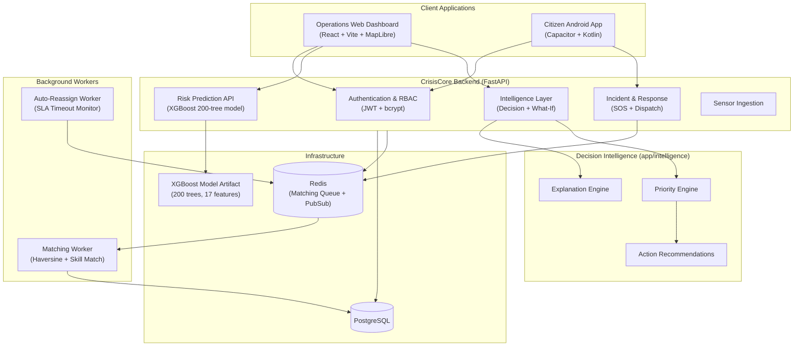
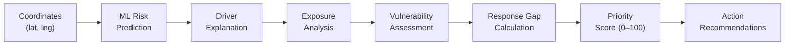
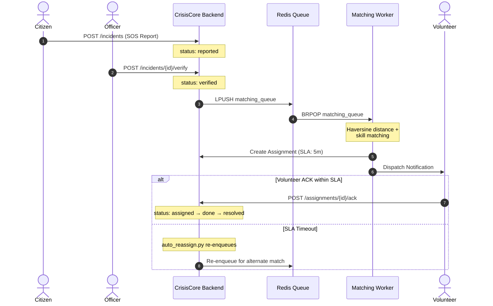

# Samvedna

### AI-Powered Disaster Intelligence & Response Platform

*From early warning to coordinated response.*

---

Samvedna is an operational disaster-intelligence platform built for India's landslide-prone North Eastern Region (NER). It bridges the critical gap between hazard prediction and field response — converting uncertain environmental signals into understandable risk, affected-population context, response priority, actionable decisions, and coordinated incident management.

The platform is built around **CrisisCore**, a FastAPI backend powering real-time ML risk prediction, explainable decision intelligence, and emergency response coordination, served to two distinct client interfaces: an **Operations Web Dashboard** for authorized disaster management officers and an **Android Citizen Application** for public emergency reporting.

> **Integrity Note:** Samvedna does not claim to independently predict natural disasters with absolute certainty. It provides an end-to-end operational decision-support system combining ML hazard intelligence, explainability, demographic exposure mapping, deterministic priority triage, responder mobilization, and data-reliability safeguards — all under human oversight.

---

## Table of Contents

- [SIH Problem Statement](#sih-problem-statement)
- [Why Samvedna](#why-samvedna)
- [System Architecture](#system-architecture)
- [Intelligence Pipeline](#intelligence-pipeline)
- [Risk Prediction & ML](#risk-prediction--ml)
- [Explainability](#explainability)
- [Priority & Decision Intelligence](#priority--decision-intelligence)
- [What-If Simulation](#what-if-simulation)
- [Incident & Response Operations](#incident--response-operations)
- [Authentication & RBAC](#authentication--rbac)
- [Client Applications](#client-applications)
- [Backend Architecture](#backend-architecture)
- [API Overview](#api-overview)
- [Data & Model Provenance](#data--model-provenance)
- [Project Structure](#project-structure)
- [Local Development](#local-development)
- [Testing & Verification](#testing--verification)
- [Configuration & Ports](#configuration--ports)
- [Current Implementation Status](#current-implementation-status)
- [Limitations](#limitations)
- [Roadmap](#roadmap)
- [Demo](#demo)
- [Team](#team)

---

## SIH Problem Statement

| Field | Detail |
|---|---|
| **ID** | SIH26001 |
| **Ministry** | Ministry of Development of North Eastern Region (MDoNER) |
| **Title** | AI-Based Early Warning and Landslide Risk Monitoring System in NER |

During the monsoon season, the 8 North Eastern states experience frequent landslides that sever highway corridors, isolate hill communities, and overwhelm local response resources. Standard monitoring tools produce raw sensor readings or risk heatmaps but leave disaster management authorities (DDMA/SDMA) with critical unanswered triage questions: *Which settlement is most vulnerable? Which road is critical? Where are responders lacking?*

A hazard score on a map does not tell a disaster officer where to send ambulances first. A high hazard score in an uninhabited ridge is low priority; a moderate hazard score threatening an isolated hospital with a single access road is critical.

---

## Why Samvedna

Most disaster early warning systems stop at generating a hazard score. Samvedna completes the operational loop:

```
Traditional Early Warning:
  Sensor Data ──▶ ML Model ──▶ Hazard Map    (stops here)

Samvedna Operational Platform:
  Environmental Sensing
       │
       ▼
  ML Landslide Risk Prediction
       │
       ▼
  Physical Factor Explanation    (Why is it risky?)
       │
       ▼
  Demographic & Infrastructure   (Who and what is in danger?)
  Exposure Analysis
       │
       ▼
  Community Vulnerability         (What worsens consequences?)
  Context
       │
       ▼
  Response Capacity Gap           (Do we have enough responders?)
       │
       ▼
  Deterministic Priority          (0–100 Triage Score)
  Engine
       │
       ▼
  Actionable Recommendations      (DDMA advisories, evacuation orders)
       │
       ▼
  Incident Response &             (Who can actually respond right now?)
  Volunteer Dispatch
       │
       ▼
  Audit Trail &                   (Traceable, fail-safe operations)
  Failure Safety
```

Three explicit layers of responsibility:

| Layer | Question Answered |
|---|---|
| **ML / Risk** | *How physically risky is this location?* |
| **Operational Intelligence** | *Where should emergency managers act first, why, and with what actions?* |
| **Response** | *Who is available nearby to respond right now?* |

---

## System Architecture



---

## Intelligence Pipeline

The complete decision flow for a single location:



All of this is computed in a single call to `POST /intelligence/decision`, returning a unified response containing risk assessment, human-readable explanations, exposure context, priority triage, and recommended civil defense actions.

---

## Risk Prediction & ML

### Canonical Model

| Property | Value |
|---|---|
| **Algorithm** | XGBoost (Gradient Boosted Decision Trees) |
| **Model Version** | `xgboost_landslide_24h_200trees` |
| **Trees** | 200 |
| **Max Depth** | 4 |
| **Operational Threshold** | 0.87 (configurable via `ML_THRESHOLD`) |
| **Artifact** | `data/processed/ml/models/xgboost_landslide_24h_best_trees.json` |
| **Inference** | Pure-Python tree traversal (zero native dependency) + optional `xgboost.Booster` |

### 17-Feature Input Contract

The model operates on 17 canonical features spanning two domains:

**Rainfall (10 features)**

| Feature | Description |
|---|---|
| `rainfall_24h` | 24-hour cumulative rainfall (mm) |
| `rainfall_3day` | 3-day cumulative rainfall (mm) |
| `rainfall_7day` | 7-day cumulative rainfall (mm) |
| `rainfall_14day` | 14-day cumulative rainfall (mm) |
| `rainfall_30day` | 30-day cumulative rainfall (mm) |
| `heavy_rain_flag` | IMD heavy rainfall threshold indicator |
| `very_heavy_rain_flag` | IMD very heavy rainfall threshold indicator |
| `rainfall_previous_day` | Previous day rainfall (mm) |
| `rainfall_2day_lag` | 2-day lagged rainfall (mm) |
| `rainfall_3day_lag` | 3-day lagged rainfall (mm) |

**Terrain (7 features)**

| Feature | Description |
|---|---|
| `elevation_mean_m` | Mean elevation of the zone (m) |
| `elevation_min_m` | Minimum elevation (m) |
| `elevation_max_m` | Maximum elevation (m) |
| `elevation_std_m` | Elevation standard deviation (m) |
| `slope_mean_deg` | Mean slope angle (degrees) |
| `slope_max_deg` | Maximum slope angle (degrees) |
| `slope_std_deg` | Slope standard deviation (degrees) |

### Prediction Output

| Field | Description |
|---|---|
| `risk_score` | Probability in [0.0, 1.0] |
| `risk_level` | `HIGH` (≥ 0.7), `MEDIUM` (≥ 0.4), `LOW` (< 0.4) |
| `confidence` | Dynamically computed, never hardcoded |
| `drivers` | Ranked list of contributing features from actual model importances |
| `feature_attributions` | Per-feature importance values from audited XGBoost model |
| `model_version` | `xgboost_landslide_24h_200trees` |
| `data_status` | `live`, `simulated`, `stale`, `fallback`, or `unavailable` |

### Top Feature Importances (Audited)

| Feature | Importance |
|---|---|
| `rainfall_3day` | 0.1070 |
| `rainfall_7day` | 0.0974 |
| `slope_mean_deg` | 0.0904 |
| `slope_max_deg` | 0.0825 |
| `rainfall_24h` | 0.0673 |
| `elevation_std_m` | 0.0671 |
| `rainfall_30day` | 0.0643 |

---

## Explainability

The explanation engine (`app/intelligence/explanation.py`) translates raw ML feature keys into human-readable labels, descriptions, units, and domain categories. Each driver (e.g., `rainfall_3day`) is mapped to a structured explanation:

```json
{
  "key": "rainfall_3day",
  "label": "3-day Cumulative Rainfall",
  "description": "Elevated rainfall over the last 3 days contributes to soil saturation.",
  "unit": "mm",
  "category": "hydrology",
  "value": 164.2
}
```

The explanation layer supports variable-count driver responses — the frontend renders dynamically based on how many features the model identifies as significant for a given prediction.

---

## Priority & Decision Intelligence

**File:** `app/intelligence/priority.py`

The priority engine is **deterministic, rule-based, and explainable** — it is not a black-box ML model.

### Formula

```
Priority Score = 100 × (
    0.35 × Risk Score
  + 0.30 × Exposure Score
  + 0.20 × Vulnerability Score
  + 0.15 × Response Gap Score
)
```

All sub-scores are normalized between 0.0 and 1.0. Weights are configurable via environment variables (`PRIORITY_W_RISK`, `PRIORITY_W_EXPOSURE`, `PRIORITY_W_VULNERABILITY`, `PRIORITY_W_RESPONSE_GAP`).

### Sub-Score Computation

| Factor | Source | Key Inputs |
|---|---|---|
| **Risk** | ML model output | Hazard probability [0.0–1.0] |
| **Exposure** | ExposureZone records | Population (cap 5000), households (1500), schools (5), hospitals (3), critical roads (3) |
| **Vulnerability** | Community context | Distance to nearest hospital (> 50 km → 1.0), early warning availability, road access quality |
| **Response Gap** | Volunteer/resource proximity | Local supply vs. incident severity demand; zero responders → gap = 1.0 |

### Triage Categories

| Level | Score | Operational Meaning |
|---|---|---|
| **CRITICAL** | ≥ 80 | Immediate life-safety threat; mandatory evacuation & inter-district mutual aid |
| **HIGH** | ≥ 60 | Severe hazard; alert DDMA, preposition SDRF, stage road closures |
| **MEDIUM** | ≥ 40 | Moderate risk; increase sensor monitoring, notify community leaders |
| **LOW** | < 40 | Advisory monitoring; standard operating posture |

> These thresholds represent **operational triage classifications** designed for emergency resource allocation, not scientifically certified disaster thresholds.

### Action Recommendations

The action engine (`app/intelligence/actions.py`) generates deterministic civil defense advisories based on priority level, risk drivers, and exposure context. Actions are concrete operational instructions (e.g., *"Pre-position NDRF search and rescue units at district staging hub"*), not generic warnings.

---

## What-If Simulation

**Endpoint:** `POST /intelligence/whatif` — Restricted to `officer` and `admin` roles.

The What-If simulator allows emergency planners to test hypothetical weather scenarios (e.g., +300 mm anticipated rainfall) to evaluate how risk escalation would shift priority levels, widen response gaps, and trigger new civil defense actions.

```json
{
  "scenario_label": "SIMULATION — NOT A FORECAST",
  "current_risk_score": 0.45,
  "projected_risk_score": 0.75,
  "current_priority_level": "MEDIUM",
  "projected_priority_level": "HIGH",
  "current_actions": ["Increase telemetry check frequency"],
  "projected_actions": [
    "Issue DDMA Level 2 alert",
    "Pre-stage evacuation transport for vulnerable settlements"
  ],
  "data_status": "simulated"
}
```

> **Core Rule:** All simulation outputs are explicitly tagged with `scenario_label: "SIMULATION — NOT A FORECAST"` and `data_status: "simulated"`. Simulated data is never presented as live telemetry.

---

## Incident & Response Operations

Samvedna implements an asynchronous emergency response lifecycle:



Key capabilities:
- Citizen SOS submission with offline batch sync (`POST /incidents/sync`)
- Officer verification gate before dispatch
- Multi-factor volunteer matching (distance, skills, availability)
- Configurable SLA timeouts with automatic reassignment
- Immutable audit trail for every state transition

---

## Authentication & RBAC

| Property | Implementation |
|---|---|
| **Token Type** | JWT bearer (HMAC-SHA256) |
| **Password Storage** | bcrypt via passlib (plaintext never stored or logged) |
| **Token Claims** | User ID, role, expiration |
| **Token TTL** | Configurable (`JWT_EXPIRE_MINUTES`, default: 1440 min / 24h) |

### Role Hierarchy

| Role | Capabilities |
|---|---|
| `citizen` | Submit SOS reports, view risk intelligence, track incident status |
| `volunteer` | All citizen capabilities + heartbeat GPS, accept/complete assignments |
| `officer` | All volunteer capabilities + verify/reject incidents, create assignments, What-If simulation, exposure management |
| `admin` | Full operational access |

### Security Posture

- RBAC is enforced server-side via FastAPI dependency injection (`require_role`)
- What-If simulation and exposure management are restricted to `officer` and `admin`
- Citizen tokens are never automatically elevated to higher roles
- No hardcoded default credentials in frontend or backend source code
- No automatic admin provisioning from the frontend
- Audit log entries automatically redact sensitive fields (`password_hash`, `token`, `secret`, `api_key`, `jwt`)
- Sanitized 500 error responses prevent stack trace / filesystem path leakage

---

## Client Applications

Samvedna serves two distinct user-facing clients, both connecting to the same CrisisCore backend:

### 1. Operations Web Dashboard

| Property | Detail |
|---|---|
| **Framework** | React 19 + TypeScript 6 + Vite 8 |
| **Map Engine** | MapLibre GL |
| **Styling** | Tailwind CSS 4 |
| **Purpose** | Authorized monitoring, risk intelligence, decision support, incident operations |
| **Users** | DDMA/SDMA officers, emergency coordinators, administrators |

Key features:
- Live ML risk zone visualization on interactive 3D terrain map
- "Why Risk" modal with dynamic driver explanations from XGBoost
- What-If counterfactual scenario simulation with `SIMULATION — NOT A FORECAST` banner
- Operational authentication modal (manual login, no auto-provisioning)
- Incident management and SOS tracking
- Offline-first data sync with IndexedDB queue

### 2. Citizen Android Application

| Property | Detail |
|---|---|
| **Platform** | Android (Capacitor + Gradle) |
| **Location** | `frontend/android/` |
| **Purpose** | Citizen emergency reporting, SOS submission, incident status tracking |
| **Users** | General public in NER |

The Android app shares the web frontend codebase via Capacitor and connects to the same CrisisCore backend API. Full native integration is in progress.

---

## Backend Architecture

Built with **FastAPI**, **SQLAlchemy (Async)**, **Redis**, and **Pydantic v2**.

```
app/
├── background/
│   ├── auto_reassign.py         # SLA timeout monitor and re-enqueue worker
│   └── matching_worker.py       # Redis queue consumer for multi-factor dispatch
├── core/
│   ├── audit_logger.py          # SQLAlchemy event listeners with PII masking
│   ├── auth.py                  # JWT creation, verification, bcrypt, RBAC guards
│   ├── config.py                # Centralized environment settings (Pydantic Settings)
│   ├── database.py              # Async engine, sessionmaker, Base declarations
│   └── redis.py                 # Redis async client connection pool
├── intelligence/
│   ├── actions.py               # Deterministic civil defense recommendation generator
│   ├── explanation.py           # Human-readable driver label mapping
│   └── priority.py              # Composite priority formula & factor normalizers
├── matching/
│   └── engine.py                # Haversine distance + skill + resource scoring
├── models/
│   ├── assignment.py            # Volunteer assignment with SLA deadlines
│   ├── audit.py                 # AuditLog entity diffs and actor tracking
│   ├── exposure.py              # ExposureZone demographics and infrastructure
│   ├── incident.py              # Incident emergency reports
│   ├── mesh.py                  # Mesh network relay messages
│   ├── notification.py          # Notification delivery logs
│   ├── resource.py              # Emergency resources (ambulances, earthmovers)
│   ├── risk.py                  # RiskZone geospatial predictions
│   ├── user.py                  # User credentials and RBAC roles
│   └── volunteer.py             # Volunteer profiles, skills, GPS coordinates
├── notifications/
│   └── dispatcher.py            # Notification abstraction (Console / Twilio / FCM)
├── realtime/
│   └── ws_manager.py            # WebSocket connection manager + Redis Pub/Sub
├── routers/
│   ├── assignments.py           # Assignment lifecycle and volunteer ACK
│   ├── auth.py                  # Registration and JWT login
│   ├── health.py                # DB + Redis health checks with queue metrics
│   ├── incidents.py             # SOS submission, verification, offline sync
│   ├── intelligence.py          # Decision endpoint, What-If, exposure CRUD
│   ├── mesh.py                  # Mesh relay ingestion
│   ├── notifications.py         # Notification history
│   ├── resources.py             # Emergency equipment management
│   ├── risk.py                  # Risk predictions, zone queries, explanations
│   ├── sensors.py               # Sensor data ingestion
│   ├── status.py                # System status endpoint
│   └── volunteers.py            # Volunteer registration and heartbeat
├── schemas/                     # Pydantic request/response validation schemas
├── services/
│   └── prediction_service.py    # Canonical ML inference service (XGBoost)
└── main.py                      # FastAPI app initialization, lifespan, CORS
```

---

## API Overview

Full interactive documentation is available at `http://127.0.0.1:8001/docs` (Swagger UI) and `http://127.0.0.1:8001/openapi.json` when the backend is running locally.

### Authentication

| Method | Path | Auth | Purpose |
|---|---|---|---|
| `POST` | `/auth/register` | Public | Register citizen, volunteer, or officer account |
| `POST` | `/auth/login` | Public | Authenticate and receive JWT bearer token |

### Risk Intelligence

| Method | Path | Auth | Purpose |
|---|---|---|---|
| `POST` | `/risk` | `officer`, `admin` | Ingest ML risk predictions |
| `GET` | `/risk` | Authenticated | Query active risk zones (bbox, horizon filters) |
| `GET` | `/risk/{zone_id}/explain` | Authenticated | Human-readable driver explanations |

### Decision Intelligence

| Method | Path | Auth | Purpose |
|---|---|---|---|
| `POST` | `/intelligence/decision` | Authenticated | Unified decision: Risk → Explanation → Exposure → Priority → Actions |
| `GET` | `/intelligence/decision/{zone_id}` | Authenticated | Decision view for a stored RiskZone |
| `POST` | `/intelligence/whatif` | `officer`, `admin` | Scenario simulator (labelled `SIMULATION — NOT A FORECAST`) |

### Exposure Management

| Method | Path | Auth | Purpose |
|---|---|---|---|
| `POST` | `/intelligence/exposure` | `officer`, `admin` | Create exposure zone (population, infrastructure) |
| `GET` | `/intelligence/exposure` | Authenticated | List registered exposure zones |
| `GET` | `/intelligence/exposure/nearby` | Authenticated | Query exposure zones within radius |

### Incidents & Dispatch

| Method | Path | Auth | Purpose |
|---|---|---|---|
| `POST` | `/incidents` | `citizen+` | Submit emergency SOS report |
| `GET` | `/incidents` | Authenticated | List/filter incidents |
| `POST` | `/incidents/{id}/verify` | `officer`, `admin` | Verify and enqueue for matching |
| `POST` | `/incidents/{id}/reject` | `officer`, `admin` | Reject invalid report |
| `POST` | `/incidents/sync` | `citizen+` | Idempotent offline batch sync |

### Assignments & Volunteers

| Method | Path | Auth | Purpose |
|---|---|---|---|
| `POST` | `/assignments` | `officer`, `admin` | Manual volunteer assignment |
| `POST` | `/assignments/{id}/ack` | Assigned volunteer | Acknowledge within SLA |
| `PATCH` | `/assignments/{id}/status` | Assigned volunteer | Transition status |
| `POST` | `/volunteers/heartbeat` | `volunteer+` | Update GPS and availability |

### Infrastructure & Health

| Method | Path | Auth | Purpose |
|---|---|---|---|
| `GET` | `/health` | Public | DB, Redis, and queue health check |
| `POST` | `/resources` | `officer`, `admin` | Register emergency equipment |
| `GET` | `/resources` | Authenticated | List available resources |
| `POST` | `/mesh/relay` | Public | Offline mesh network relay |
| `WS` | `/ws/status` | Public | Real-time incident status WebSocket |

---

## Data & Model Provenance

To ensure operational transparency, Samvedna enforces strict provenance tagging across all risk, exposure, and decision endpoints:

| Status | Meaning |
|---|---|
| `live` | Real-time telemetry or active sensor readings |
| `simulated` | Synthetic benchmarks or What-If scenario outputs |
| `replayed` | Historical sensor logs streamed for validation |
| `stale` | Data exceeding `RISK_FRESHNESS_MINUTES` (default: 60 min) |
| `fallback` | Deterministic fallback when model artifact is unavailable |
| `unavailable` | Missing model outputs; returns `HTTP 503` instead of fabricated predictions |

### Failure Safety

- **Risk model unavailable:** Returns `503 Service Unavailable` with `X-Error-Code: RISK_SERVICE_UNAVAILABLE`. Never fabricates predictions.
- **Stale data:** Automatic `data_status: "stale"` transition when sensor feeds stop reporting.
- **No available responders:** Records `supply = 0`, sets `response_gap = 1.0`, triggers mutual aid advisories. Never creates fake assignments.
- **Dispatcher failure:** Records `status: "failed"` in `NotificationLog` for automated retry without crashing the dispatch loop.

---

## Project Structure

```
Samvedna-SIH2026/
├── app/                    # CrisisCore FastAPI backend
│   ├── background/         # Async workers (matching, reassignment)
│   ├── core/               # Auth, config, database, Redis
│   ├── intelligence/       # Decision engine (explanation, priority, actions)
│   ├── matching/           # Volunteer matching engine
│   ├── models/             # SQLAlchemy ORM models
│   ├── notifications/      # Dispatch abstraction (Console/Twilio/FCM)
│   ├── realtime/           # WebSocket manager
│   ├── routers/            # FastAPI route handlers
│   ├── schemas/            # Pydantic validation schemas
│   ├── services/           # ML prediction service
│   └── main.py             # Application entrypoint
├── frontend/               # Operations Web Dashboard
│   ├── src/                # React + TypeScript application source
│   ├── tests/              # Frontend test suites
│   ├── android/            # Citizen Android app (Capacitor)
│   └── vite.config.ts      # Vite build configuration
├── ml/                     # ML pipeline scripts
│   ├── train_landslide_model.py
│   ├── live_risk_engine.py
│   ├── build_terrain_features.py
│   └── ...                 # ~70 pipeline and evaluation scripts
├── data/                   # Source data and model artifacts
│   ├── processed/ml/models/  # XGBoost model + feature importances
│   └── *.csv               # NER districts, events, features
├── tests/                  # Backend pytest suite (21 test files (153 passed))
├── docker-compose.yml      # Full-stack containerized deployment
├── requirements.txt        # Python backend dependencies
└── run.py                  # Development server entrypoint
```

---

## Local Development

### Prerequisites

- Python 3.11+
- Node.js 20+ and npm
- Redis server (local or Docker)
- PostgreSQL (recommended) or SQLite (default for development)

### Backend Setup

```bash
# Clone and checkout
git clone <repository-url>
cd Samvedna-SIH2026
git checkout AJ-backend-work

# Create virtual environment
python -m venv .venv

# Activate (Windows PowerShell)
.venv\Scripts\Activate.ps1
# Activate (Linux / macOS)
source .venv/bin/activate

# Install dependencies
pip install -r requirements.txt

# Configure environment
cp .env.example .env
# Edit .env as needed (see Configuration section)

# Start backend
python -m uvicorn app.main:app --host 127.0.0.1 --port 8001
```

### Frontend Setup

```bash
cd frontend

# Install dependencies
npm install

# Configure API target
cp .env.example .env
# Ensure VITE_API_URL=http://127.0.0.1:8001

# Start development server
npm run dev
# Frontend runs at http://127.0.0.1:5173
```

### API Documentation

With the backend running:

- **Swagger UI:** http://127.0.0.1:8001/docs
- **OpenAPI JSON:** http://127.0.0.1:8001/openapi.json

---

## Testing & Verification

### Backend Test Suite

```bash
python -m pytest tests/ -q
```

The backend maintains 21 test files (153 passed) covering:
- Core API endpoints and authentication
- RBAC authorization edge cases
- Incident verification and state machine transitions
- Volunteer matching worker and queue operations
- Priority formula and intelligence endpoints
- What-If simulation contracts
- Offline sync idempotency
- SLA timeout auto-reassignment
- Audit log lifecycle
- Data freshness and failure safety
- Sensor ingestion and critical path integration

### Frontend Verification

```bash
cd frontend

# TypeScript validation (all project references)
npx tsc -b                                    # 0 errors

# Application-only typecheck (browser types, no Node leakage)
npx tsc --noEmit -p tsconfig.app.json         # 0 errors

# Test-specific typecheck (Node types for test runner)
npx tsc --noEmit -p tsconfig.test.json        # 0 errors

# Run test suites
npx --yes tsx --test tests/offlineSync.test.ts tests/intelligence.test.ts
# 22/22 passed (13 offline sync + 9 intelligence/auth security)

# Lint
npx oxlint                                    # 0 errors

# Production build
npm run build                                 # Successful (tsc -b && vite build)
```

### Frontend Test Coverage

The intelligence test suite (`tests/intelligence.test.ts`) validates:
- Decision response parsing and rendering contracts
- Dynamic driver explanation rendering (variable count)
- What-If simulation contract and forecast distinction
- RBAC 403 handling on restricted endpoints
- API error handling without fake data fallback
- Unauthenticated state does not trigger automatic registration/login
- Source code invariant: no hardcoded credentials in `api.ts` or `OperationsAuthModal.tsx`
- Real login/logout token lifecycle
- Citizen token preservation (never elevated to admin/officer)

### TypeScript Configuration

The frontend uses a composite TypeScript project with three configurations:

| Config | Scope | Types |
|---|---|---|
| `tsconfig.app.json` | `src/` (browser application) | `vite/client` only |
| `tsconfig.node.json` | `vite.config.ts` | `node` |
| `tsconfig.test.json` | `tests/` (Node.js test runner) | `node`, `vite/client` |

This ensures Node.js types never leak into the production browser bundle.

---

## Configuration & Ports

### Local Development Ports

| Service | Port | Notes |
|---|---|---|
| **Frontend (Vite)** | `127.0.0.1:5173` | Development server with API proxy |
| **Backend (FastAPI)** | `127.0.0.1:8001` | CrisisCore API server |
| **Redis** | `127.0.0.1:6380` | Matching queue and Pub/Sub |
| **PostgreSQL** | `5432` | Default PostgreSQL port |

> **Important:** Ports `8000` and `6379` are intentionally not used by Samvedna in local development. They belong to other local projects/environments and must not be touched.

### Environment Variables

Copy `.env.example` to `.env` and configure:

| Variable | Default | Purpose |
|---|---|---|
| `DATABASE_URL` | `sqlite+aiosqlite:///./crisiscore.db` | Database connection (SQLite or PostgreSQL) |
| `REDIS_URL` | `redis://localhost:6380/0` | Redis connection for queue and Pub/Sub |
| `JWT_SECRET` | `<change-in-production>` | HMAC-SHA256 JWT signing secret |
| `JWT_ALGORITHM` | `HS256` | JWT signing algorithm |
| `JWT_EXPIRE_MINUTES` | `1440` | Token TTL (default: 24 hours) |
| `AUTO_REASSIGN_MINUTES` | `5` | SLA timeout before volunteer reassignment |
| `RISK_FRESHNESS_MINUTES` | `60` | Max age before risk data marked stale |
| `NOTIFICATION_PROVIDER` | `console` | Dispatch backend (`console`, `twilio`, `fcm`) |
| `PRIORITY_W_RISK` | `0.35` | Priority weight: hazard risk |
| `PRIORITY_W_EXPOSURE` | `0.30` | Priority weight: population exposure |
| `PRIORITY_W_VULNERABILITY` | `0.20` | Priority weight: community vulnerability |
| `PRIORITY_W_RESPONSE_GAP` | `0.15` | Priority weight: responder capacity deficit |
| `ML_THRESHOLD` | `0.87` | XGBoost operational classification threshold |
| `CORS_ORIGINS` | `["*"]` | Allowed frontend origins (restrict in production) |

---

## Current Implementation Status

### Implemented & Verified

| Component | Status | Details |
|---|---|---|
| XGBoost landslide risk prediction | Verified | 200-tree model, 17 features, live inference via `POST /risk` |
| Risk zone querying and explanation | Verified | `GET /risk`, `GET /risk/{zone_id}/explain` |
| Intelligence decision pipeline | Verified | `POST /intelligence/decision` with full Risk → Explain → Expose → Priority → Actions flow |
| What-If scenario simulation | Verified | `POST /intelligence/whatif` with `SIMULATION — NOT A FORECAST` tagging |
| Priority engine | Verified | Deterministic weighted formula, configurable weights |
| JWT authentication & RBAC | Verified | 4-tier hierarchy, server-side role enforcement |
| Incident lifecycle | Verified | SOS → Verify → Queue → Match → Assign → ACK → Resolve |
| Volunteer matching | Verified | Haversine distance + skill matching via Redis queue |
| SLA auto-reassignment | Verified | Background worker monitoring unacknowledged assignments |
| Offline incident sync | Verified | Idempotent batch sync with timestamp preservation |
| Audit trail | Verified | Immutable state diffs with PII redaction |
| Operations Web Dashboard | Verified | Live risk map, Why Risk, What-If UI, operational auth |
| Frontend API integration (P0) | Verified | Live risk + incident APIs integrated |
| Frontend intelligence integration (P1) | Verified | Decision, What-If, RBAC, dynamic explanations |
| Frontend security hardening | Verified | No hardcoded credentials, no auto-provisioning |
| Frontend TypeScript validation | Verified | Composite project refs, 0 errors across all configs |
| Frontend test suite | Verified | 22/22 tests passing (intelligence + offline sync) |
| Backend test suite | Verified | Comprehensive pytest suite (21 test files (153 passed)) |

### In Progress

| Component | Status |
|---|---|
| Citizen Android app backend integration | Capacitor scaffold present; native integration pending |
| Real-time sensor data ingestion | Endpoints implemented; live IMD/satellite feed pending |

---

## Limitations

In the interest of engineering transparency:

- **Exposure baseline data:** Settlement demographic and infrastructure data currently uses benchmark profiles where live municipal GIS integration is pending.
- **Priority engine weights:** The default weights (0.35, 0.30, 0.20, 0.15) are engineering-defined heuristic defaults and have not yet undergone empirical regional field calibration.
- **What-If simulation:** The What-If endpoint is a heuristic scenario exploration tool, **not** a calibrated numerical weather forecast model.
- **Prototype status:** This system is an SIH prototype and is not yet certified for official government disaster command operations without human oversight.

---

## Roadmap

| Category | Planned Work |
|---|---|
| **Data Integration** | Live IMD radar feed ingestion, Copernicus Sentinel raster processing, SMAP soil moisture integration |
| **Mobile** | Complete Citizen Android app backend integration and native testing |
| **Security** | Production secret management, HTTPS enforcement, rate limiting, CORS lockdown |
| **Observability** | Structured logging, Prometheus metrics, alerting on stale data / queue depth |
| **Performance** | Load testing, connection pooling optimization, production Redis cluster |
| **Localization** | Multilingual citizen alerts (Assamese, Bengali, Bodo, Khasi, Mizo, Hindi) |
| **Deployment** | Container orchestration, CI/CD pipeline, staging environment |
| **Geospatial** | Vector overlays for bridges, electrical substations, water supply, relief shelters |

---

## Demo

> Screenshots and an end-to-end demonstration video will be added here for the final SIH submission.

---

## Team

> Team member details will be added here.

---

*Samvedna — From early warning to coordinated response.*
